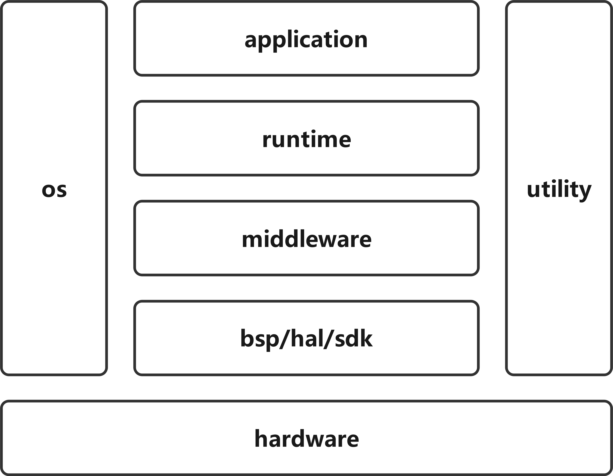

# UNISAR

UNISAR (UNIversal Software ARchitecture), 一款适用于嵌入式汽车电子 MCU 方面的通用架构。

* C 语言
* GCC 编译构建
* 面向对象思想
* 使用 OS

## 01. 架构

# 99. 缩写

| 缩写 | 全称                        | 中文         |
| ---- | --------------------------- | ------------ |
| bsp  | board support package       | 板级支持包   |
| gcc  | gnu compiler collection     | gnu编译器集  |
| hal  | hardware abstraction layer | 硬件抽象层   |
| os   | operating system           | 操作系统     |
| sdk  | software development kit    | 软件开发套件 |
