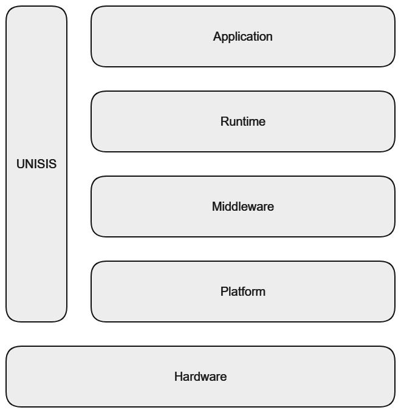

# UNISAR

UNISAR (UNIversal Software ARchitecture), 一款适用于嵌入式软件方面的通用架构。

* C 语言
* GCC 编译构建
* 面向对象思想
* 使用 OS

## 01. 架构

# 99. 缩写

| 缩写   | 全称                                  | 中文             |
| ------ | ------------------------------------- | ---------------- |
| bsp    | board support package                 | 板级支持包       |
| config | configuration                         | 配置             |
| gcc    | gnu compiler collection               | gnu编译器集      |
| hal    | hardware abstraction layer           | 硬件抽象层       |
| impl   | implements                            | 实现类           |
| intf   | interface                             | 接口类           |
| os     | operating system                     | 操作系统         |
| sdk    | software development kit              | 软件开发套件     |
| unisar | universal software architecture       | 通用软件架构     |
| unisis | universal software interface standard | 通用软件接口标准 |
